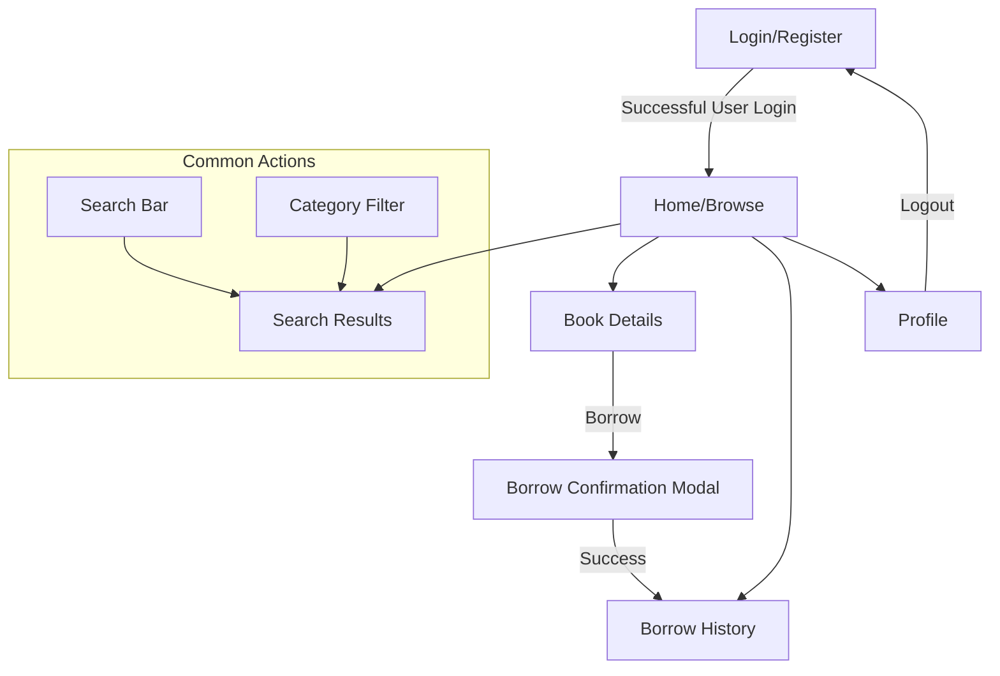

# Detailed UI Rules for User Screens and Flows in Electronic Library System

This document outlines detailed UI rules, screens, and navigation flows for the User role in the **Electronic Library System**. The UI emphasizes user-friendliness, with a focus on browsing and borrowing books in a modern, engaging interface. All screens follow the general UI rules below.

## General UI Rules
- **Design Style**: Youthful and modern, with vibrant orange accents (#FF6B00), soft peach backgrounds (#FFDAB9), and clean white space. Sans-serif fonts for readability. Rounded elements and subtle animations for interactivity.
- **Responsive Design**: Adapt to devices; stack content on mobile, side-by-side on desktop.
- **Accessibility**: Screen reader support, focus states for buttons, sufficient color contrast.
- **Components**: Search bar (debounced), cards for books (with images), buttons (borrow/return), modals for confirmations, pagination for lists.
- **Navigation**: Top navbar with search; user menu for profile/logout.
- **Error Handling**: Friendly messages (e.g., "Book not available"), toasts for actions.
- **Performance**: Infinite scroll for book lists if possible, or pagination.
- **Security**: Hide Admin features; require login for borrow/profile.

## User Screens Overview
User focuses on discovery and personal management. Key screens:
1. **Login/Register**: Entry point.
2. **Home/Browse**: Main book discovery.
3. **Book Details**: View single book.
4. **Search Results**: Filtered books.
5. **Borrow History**: User's borrows.
6. **Profile**: Personal info.
7. **Logout**: Return to login.

## Navigation Flows
User flows are content-driven, starting from home. Mermaid diagram:

### Flow Descriptions
- **Login to Home**: Post-login redirect to Home with personalized recommendations.
- **Home to Search/Book Details**: Search or click card leads to results/details.
- **Book Details to Borrow**: Borrow button opens modal; success updates history and availability.
- **History to Details**: Click borrow item views book details.
- **Profile to Logout**: Update info or logout.
- **Error Flows**: Unauthenticated borrow redirects to Login; overdue books show warnings.

## Detailed Screen Rules
- **Login/Register**:
  - UI Elements: Forms with fields (username, password, email). Social login if added.
  - Rules: Real-time validation; forgot password link.

- **Home/Browse**:
  - UI Elements: Hero banner (e.g., "Discover Books"), book cards grid (title, author, cover image), category sidebar, search bar.
  - Rules: Infinite scroll or pagination; featured/recommended sections.

- **Book Details**:
  - UI Elements: Large cover, description, authors/categories, borrow/return button, related books.
  - Rules: Read online preview if available; disable borrow if unavailable.

- **Search Results**:
  - UI Elements: Grid/list of book cards, filters (category, author, year), sort (relevance, date).
  - Rules: Debounce search; no results message with suggestions.

- **Borrow History**:
  - UI Elements: Table/cards (book, borrow date, due date, status). Return button for active borrows.
  - Rules: Highlight overdue (red); pagination.

- **Profile**:
  - UI Elements: User info form (edit name/email), change password, borrow stats.
  - Rules: Secure updates; logout confirmation.

Follow these for a cohesive User UI.

Generated on: September 29, 2025